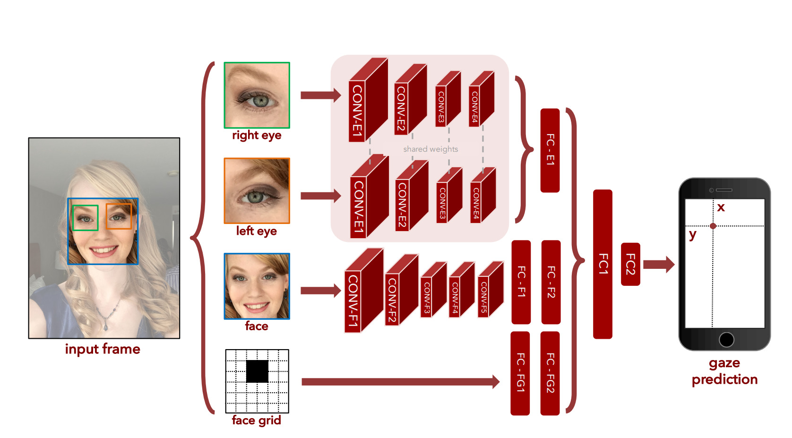
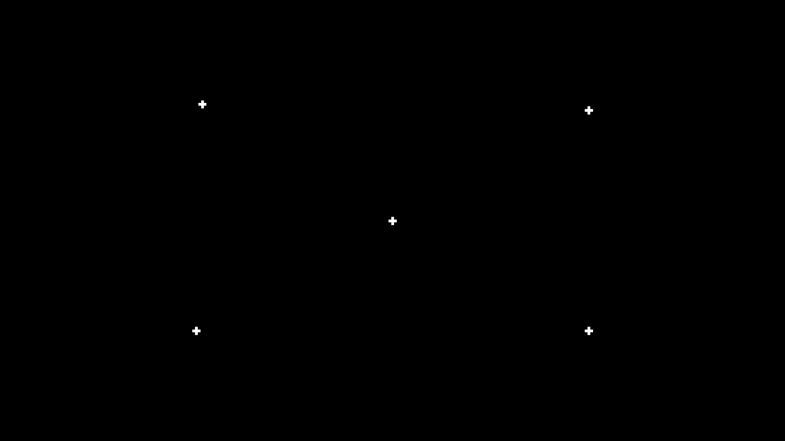
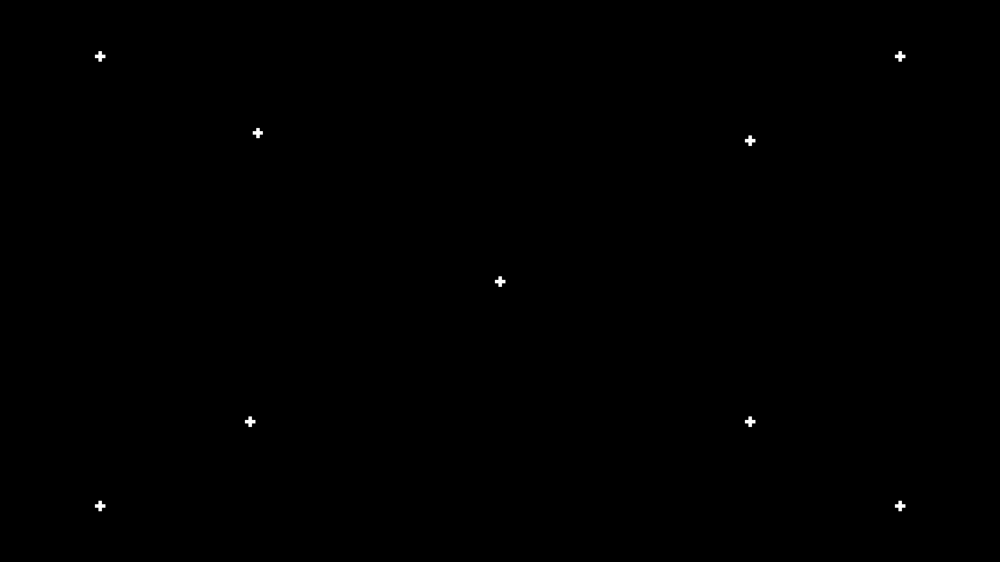
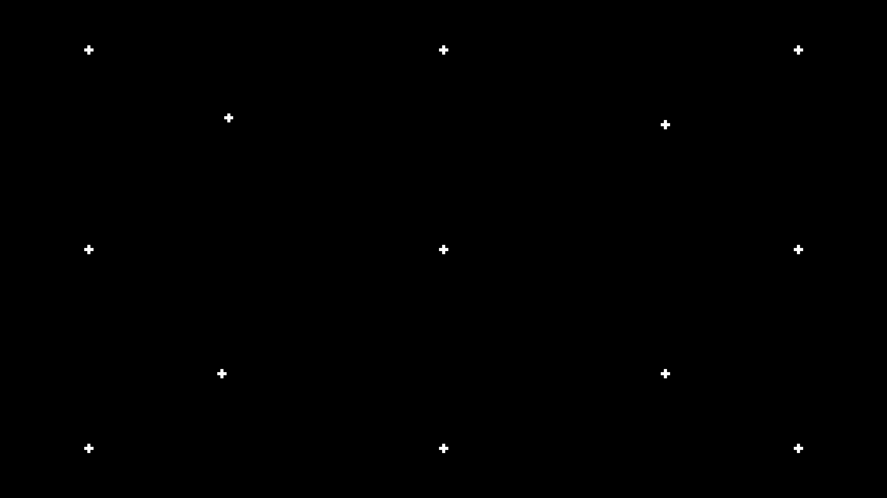

===========
EyeTracking
===========

.. toctree::
   :maxdepth: 1

   GazeDataLogger.rst
   GazeModel.rst
   GazeTracker.rst
   Calibration.rst
   utils.rst
   config.rst

----

**EyeTracking** is a gaze-tracking project based on deep learning techniques.  
The system allows for **real-time gaze estimation**, leveraging a **pre-trained model**  
and an additional **fine-tuning step** through calibration.

.. contents:: **Table of Contents**
   :local:
   :depth: 2

Project Overview
================

We use the pre-trained **GazeCapture** model for eye tracking, based on deep learning techniques.  
The original model was developed by MIT CSAIL and is presented in the paper:

**Eye Tracking for Everyone**  
Krafka et al. (2016)  
`Read on arXiv <https://arxiv.org/abs/1606.05814>`_

The model is available at: `GazeCapture GitHub <https://github.com/CSAILVision/GazeCapture>`_.

Adapting GazeCapture for Universal Use
--------------------------------------

Originally, the **GazeCapture** model was designed to work with the **iTracker** system,  
which extracts input features from images captured on Apple devices such as **iPhones** and **iPads**.  
This made the model specifically optimized for Apple's ecosystem.

In our project, we adapted the pre-trained GazeCapture model by modifying the feature extraction pipeline.  
Instead of relying on **iTracker**, we use a combination of **MediaPipe** and **OpenCV** to extract the necessary  
features directly from a **webcam**. This adaptation allows us to **predict which quadrant of the screen the user is looking at**  
without the need for specialized Apple hardware.

Expanding Accessibility and Applications
----------------------------------------

By enabling webcam-based eye tracking, we make this technology accessible to a wider audience,  
allowing its use on various devices beyond Apple’s ecosystem. This has multiple potential applications, including:

- **Human-Computer Interaction (HCI)**: Enhancing accessibility for users with disabilities.
- **Gaming**: Implementing gaze-based controls in interactive experiences.
- **Psychological and Cognitive Research**: Studying attention and gaze behavior.
- **Marketing and UX Studies**: Analyzing user engagement with digital content.

This project **tracks the user's gaze in real-time** and allows **fine-tuning through calibration**,  
improving accuracy for each individual user.

Deep Learning Model Complexity
------------------------------

The **GazeCapture** model is a deep learning architecture trained to predict gaze direction based on images of the user's face and eyes.  
It leverages a **convolutional neural network (CNN)** to process image inputs and infer gaze position. The architecture consists of:

- **Face and Eye Input Processing**:  

  - Two separate **Convolutional Neural Networks (CNNs)** extract features from **left and right eye images**.
  - A third **CNN processes the full-face image** to provide additional contextual information.

- **Feature Fusion and Dense Layers**:  

  - The extracted features from the **face and eye CNNs** are concatenated and passed through fully connected layers.
  - The **gaze direction is estimated** using regression layers at the output.

- **Network Specifications**:

  - **Input dimensions**:  
  
    - Face image: **224×224 pixels**  
    - Eye images: **224×224 pixels** (left and right separately)  
	
  - **Convolutional Layers**:  
  
    - Each CNN (eye and face networks) consists of multiple convolutional layers (typically **5 layers per network**).  
    - Kernel sizes: **3×3 and 5×5** convolutions.  
	
  - **Fully Connected Layers**:  
  
    - Around **3 dense layers with 1024 neurons each** before outputting gaze coordinates.  
	
  - **Activation Functions**:  
  
    - Uses **ReLU (Rectified Linear Unit)** for non-linearity.
	
  - **Final Output**:  
  
    - The model predicts a **2D gaze point (x, y)** in normalized screen coordinates.  
	
  - **Total Parameters**:  
  
    - The model contains approximately **10-15 million trainable parameters**.

Model Adaptation and Performance Considerations
-----------------------------------------------

In our adaptation, we ensure compatibility with **webcam input** by pre-processing images using **MediaPipe** and **OpenCV**.  
This involves:

- **Facial landmark detection** to extract eye regions.
- **Resizing and normalizing** images to match GazeCapture input dimensions.
- **Real-time inference** using the adapted pipeline for gaze quadrant prediction.

The adaptation allows us to maintain real-time processing while reducing computational overhead,  
making the system suitable for various hardware configurations, including consumer-grade laptops.

Getting Started
===============

Environment Setup
-----------------

We use **Conda** to manage the development environment.  
To create and activate the environment, run:

.. code-block:: bash

   conda create -n pfe python=3.12
   conda activate pfe
   
Dependency Installation
-----------------------

Before running the program, install the required dependencies using:

.. code-block:: bash

   make lib

This will automatically install all necessary Python packages.

Running Tests
-------------

To ensure everything is working correctly, you can run the test suite with:

.. code-block:: bash

   make test

This will execute unit tests to validate the functionality of the project.

Launch the program
------------------

To launch the program, simply run:

.. code-block:: bash

   make run

Running on a Virtual Machine (e.g., WSL2)
-----------------------------------------

If you are using a **virtual machine (VM)**, such as **WSL2**, the program **cannot access USB devices directly**,  
including the webcam. To bypass this limitation, you can use **MJPEG Streamer** to stream your webcam feed over a network.

- **Step 1: Install MJPEG Streamer** :

	**MJPEG Streamer** is available on the **Windows Store** and can also be downloaded from various sources on the Internet.  
	You can install it on your host system (Windows, Linux, or macOS) and start streaming your webcam.

	The program will automatically **use the video stream** instead of trying to access a local USB webcam.

	**Example MJPEG Streamer Interface** :

	Below is an example of the MJPEG Streamer web interface when running correctly:

	.. image:: ../images/mjpeg_streamer.png
	   :alt: MJPEG Streamer Example
	   :align: center
	   :width: 70%

	This will start a webcam stream accessible via **http://your_ip:8000/**.

- **Step 2: Set the WEBCAM_URL Environment Variable** :

	Once the stream is running, define the environment variable **`WEBCAM_URL`**  
	so that the program can use the external webcam feed:

	.. code-block:: bash

	   export WEBCAM_URL=http://74.229.179.101:8000/

	Replace `74.229.179.101:8000` with the actual **IP address and port** of your MJPEG Streamer.

- After setting up the webcam stream, you can now launch the program as usual :

.. code-block:: bash

   make run

This will start the entire pipeline, including:

1. **Calibration Phase**:

   - The user is prompted to click on specific points on the screen.
   - The system captures images of the eyes and face at each click.
   - The gaze coordinates (in **cm**) corresponding to the clicks are recorded.

2. **Fine-Tuning**:

   - The model is **fine-tuned** using the collected gaze data.
   - This ensures that predictions are personalized to the current user.

3. **Gaze Tracking**:

   - The system continuously tracks the user's gaze.
   - Predictions are given in **cm** and converted to **screen pixels**.
   - The model identifies in which **quadrant** the user is looking.
   - **Press `Q` at any time** to **stop tracking**.

4. **Experiment Logging**:

   - When the user **stops tracking** by pressing `Q`, the **gaze data is saved**.
   - The tracking session is stored in `src/experiments/` as a **timestamped `.pkl` file**.
   - These logs can later be analyzed using the provided **Jupyter Notebook**.

Configuration
=============

Before running the system, parameters can be adjusted in **`src/utils/config.py`**:

.. code-block:: python

   # Screen dimensions in pixels
   SCREEN_WIDTH: int = 2560
   SCREEN_HEIGHT: int = 1440
   MID_X: int = SCREEN_WIDTH // 2
   MID_Y: int = SCREEN_HEIGHT // 2

   # Path to the calibration image
   CALIBRATION_IMAGE_PATH = os.path.abspath(os.path.join(os.path.dirname(__file__), "calib_13/calibration_13_pts.png"))

   # Number of calibration points
   CALIBRATION_PTS: int = 13

   # Fine-tuning parameters
   LR: float = 1e-4
   EPOCH: int = 10
   BATCH_SIZE: int = 4

**Note:**  

- `GAZE_RANGE_CM = 25` is fixed and **must not be changed**.
- You can modify `CALIBRATION_PTS` to set the number of calibration points (e.g., 5, 9, or 13).
- Also you must indicate your screen width and height (SCREEN_WIDTH, SCREEN_HEIGHT)
- **Fine-tuning hyperparameters (`LR`, `EPOCH`, `BATCH_SIZE`) can be adjusted for better results.**

Calibration Process
===================

The calibration step ensures the gaze-tracking model adapts to each user.  
This process is **crucial** for improving gaze prediction accuracy.

The user clicks on several predefined points on the screen, and at each click:

- The system records **facial landmarks**.
- The system associates these landmarks with the **corresponding gaze coordinates**.

Here are **examples of calibration grids**:

**5-Point Calibration**:
  

**9-Point Calibration**:
  

**13-Point Calibration (Default)**:
  

Fine-Tuning
===========

Once calibration is completed, the model undergoes **fine-tuning**.  
The new gaze samples collected during calibration are used to adapt the model to the user.

At this stage, the **training process** is launched:

.. code-block:: text

	Fine-tuning the model with calibration data...
	Epoch 1/10, Loss: 190.7853
	Epoch 2/10, Loss: 77.8408
	Epoch 3/10, Loss: 39.9431
	Epoch 4/10, Loss: 17.7433
	Epoch 5/10, Loss: 13.6163
	Epoch 6/10, Loss: 9.1816
	Epoch 7/10, Loss: 4.7022
	Epoch 8/10, Loss: 2.6504
	Epoch 9/10, Loss: 2.5419
	Epoch 10/10, Loss: 1.7676
	Fine-tuning complete.

**Once fine-tuned**, the model performs better for the current session.

Calibration Evaluation
======================

Once the fine-tuning process is completed, the system evaluates the accuracy of the calibration  
by comparing the **true gaze points** (clicked by the user) with the **model's predicted gaze**.

The evaluation computes the **Euclidean distance error** between the actual and predicted gaze  
positions in centimeters.

An example of the calibration evaluation output:

.. code-block:: text

   Evaluation of calibration started
   True Gaze: (-20.06, 20.14) cm, Predicted Gaze: (-20.15, 18.92) cm, Error: 1.22 cm
   True Gaze: (-12.13, 13.23) cm, Predicted Gaze: (-12.32, 11.60) cm, Error: 1.64 cm
   True Gaze: (-0.10, 20.10) cm, Predicted Gaze: (-0.57, 18.11) cm, Error: 2.05 cm
   True Gaze: (12.48, 12.67) cm, Predicted Gaze: (12.11, 12.31) cm, Error: 0.51 cm
   True Gaze: (19.96, 20.21) cm, Predicted Gaze: (18.44, 21.96) cm, Error: 2.32 cm
   True Gaze: (20.04, 0.24) cm, Predicted Gaze: (20.69, 0.84) cm, Error: 0.88 cm
   True Gaze: (0.08, 0.00) cm, Predicted Gaze: (-1.03, -1.34) cm, Error: 1.74 cm
   True Gaze: (-19.98, 0.03) cm, Predicted Gaze: (-20.87, -1.14) cm, Error: 1.47 cm
   True Gaze: (-12.58, -12.64) cm, Predicted Gaze: (-12.32, -13.50) cm, Error: 0.89 cm
   True Gaze: (12.50, -12.53) cm, Predicted Gaze: (11.71, -12.68) cm, Error: 0.81 cm
   True Gaze: (19.94, -20.07) cm, Predicted Gaze: (20.06, -19.77) cm, Error: 0.32 cm
   True Gaze: (0.10, -20.00) cm, Predicted Gaze: (-0.25, -18.72) cm, Error: 1.33 cm
   True Gaze: (-19.96, -19.93) cm, Predicted Gaze: (-20.21, -20.48) cm, Error: 0.61 cm

   Calibration Accuracy: Mean Error = 1.21 cm, Std Dev = 0.59 cm

This output provides:

- **True Gaze (X, Y in cm)**: The actual gaze location recorded during calibration.
- **Predicted Gaze (X, Y in cm)**: The gaze estimated by the fine-tuned model.
- **Error (cm)**: The Euclidean distance between the true and predicted gaze.
- **Final Calibration Accuracy**:
  - **Mean Error**: The average error across all calibration points.
  - **Standard Deviation**: The variation in error across points.

A lower mean error indicates a more **precise gaze tracking model**.

Gaze Prediction & Quadrants
===========================

The model predicts **gaze position in cm**, which is then converted to **screen pixels**.

Using the screen's midpoint (`MID_X, MID_Y`), the system determines **which quadrant**  
the user is looking at:

- **Top Left**
- **Top Right**
- **Bottom Left**
- **Bottom Right**

Here’s an example of how the system classifies gaze points:

.. code-block:: python

   def determine_position(pos_x, pos_y):
       """Determines gaze position based on screen quadrants."""
       if pos_x < MID_X and pos_y < MID_Y:
           return "Top Left"
       elif pos_x > MID_X and pos_y < MID_Y:
           return "Top Right"
       elif pos_x < MID_X and pos_y > MID_Y:
           return "Bottom Left"
       elif pos_x > MID_X and pos_y > MID_Y:
           return "Bottom Right"
       else:
           return "Center"

Analyzing Tracking Data
=======================

Once an experiment is completed, the **gaze tracking data is saved**  
in `src/experiments/` under a **timestamped `.pkl` file**.

To visualize the recorded gaze tracking sessions, a **Jupyter Notebook** is provided in **notebooks/plot_gaze_tracking.ipynb**  

This notebook contains a function that **loads and plots gaze tracking data** for a given session.

To use it:

1. Open the notebook in Jupyter:

   .. code-block:: bash

      jupyter notebook notebooks/plot_gaze_tracking.ipynb

2. Select the desired experiment file and execute the following function, provided in the notebook:

   .. code-block:: python

      plot_experiments_bee("gaze_2025-02-28_04-57-25.pkl")

   The given file must be in the folder **src/experiments/** .

3. The gaze tracking bees plot will be generated. The resulting image is saved at:

   .. image:: ../images/example_bees_plot.png
      :alt: Gaze Tracking Plot
      :align: center
